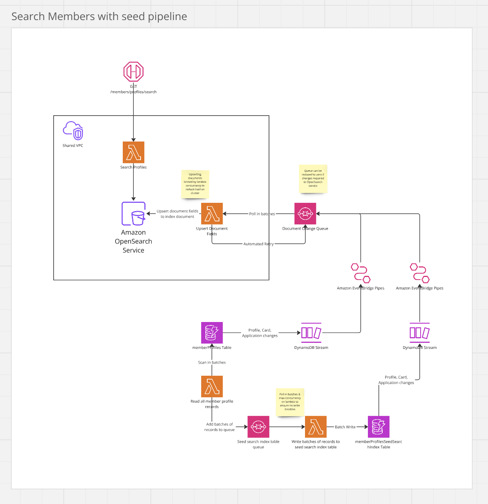

# Members

The Members package contains all API's related to member admin functionality. It is built using API Gateway,
Lambda, Opensearch and DynamoDB. Primary language is Typescript and SST is used for defining infrastructure.

## Running locally

```shell
npm run dev
```

## Testing

```shell
npm run test
```

## Linting

```shell
npm run lint
```

## Formatting

```shell
npm run format
```

## OpenSearch

OpenSearch is used for storing member data to allow searching from the admin panel via multiple filters.

There is a pipeline in place for ingesting changes from the Member Profile DynamoDB table into OpenSearch. Additionally, a full re-seed of all member data can be executed if required. 

The diagram below details the pipeline:



### Re-seeding OpenSearch index

To re-seed the OpenSearch index with all records currently in the `memberProfiles` table you need to trigger the following lambda via the console:

- `{stage}-blc-mono-MemberProfileTableReader` lambda
