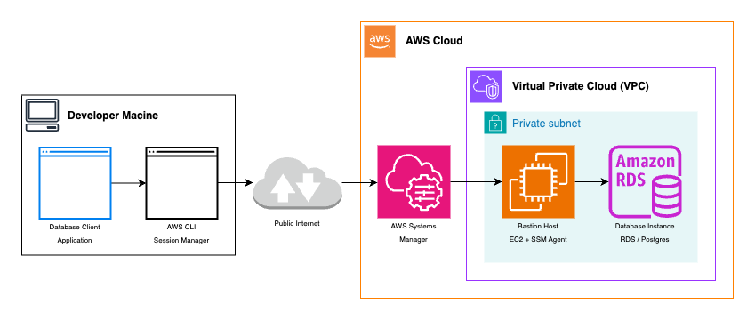

# Redemptions

## Test Users

### Generating Testing Tokens

Lightweight test users can be created for testing APIs. These are (for now) API-only users, which cannot be used to login via the front-end.

To create a test user, run:

```sh
npm run -w packages/api/redemptions createTestUser
```

This will create a test user and persist the details of this user to disk. Once a test user has been successfully created, you can generate tokens for that user with the following command.

```sh
npm run -w packages/api/redemptions authenticateTestUser
```

If you need to remove the test user, simply run:

```sh
npm run -w packages/api/redemptions deleteTestUser
```

Alternatively, if you don't need the user to be removed in cognito, you can delete the file `.redemptionsTestUserDetails.json` instead.

Please note that to run any of the above commands, you will need to be running the backend locally with `npm run dev`.

## Database

### Accessing the DB via the Bastion Host

#### Architecture

For security reasons, our database is deployed to a private subnet in our VPC. This means it is not directly accessible via the public internet. To access databases deployed in a private subnet, there are two commonly used strategies:

- Deploying a bastion host to a public subnet and connecting via SSH
- Deploying a bastion host to a private subnet and connecting via AWS SSM Session Manager

Connecting via AWS SSM Session Manager has the following benefits over SSH:

- Our bastion host does not need to be publicly accessible
- We can limit access via IAM
- We do not need to handle SSH keys (which could easily be leaked)

In order to connect via SSM, we can use the AWS CLI to set up a port forwarding session to the remote database host. This will expose the DB connection on local host via a user specified port. We can then connect to the database via localhost, using any PostgreSQL compatible database client.



#### Getting Started

Pre-requisites:

- [AWS CLI](https://aws.amazon.com/cli/)
- [Session Manager Plugin for AWS CLI](https://docs.aws.amazon.com/systems-manager/latest/userguide/session-manager-working-with-install-plugin.html)

Connecting to the database:

1. Locate the Instance ID of the bastion host
   1. Open the AWS Console
   2. Navigate to EC2 / Instances
   3. Locate the bastion host instance (in staging this is called `staging-bastion-host-redemptions`)
   4. Take note of the Instance ID
2. Locate the RDS endpoint and port you wish to connect to
   1. Open the AWS Console
   2. Navigate to RDS / Databases
   3. Locate the DB instance (in staging this will be one of the instances in `redemptions-db-cluster-staging`)
   4. Click on the instance (to avoid disasters in production, please **only use the reader instance** unless you require write access)
   5. Take note of the database instance endpoint and port (shown under the "Connectivity & security / Endpoint & port" heading)
3. Establish a port forwarding session:
   ```sh
    aws ssm start-session \
      --target "<bastion-host-instance-id>" \
      --document-name AWS-StartPortForwardingSessionToRemoteHost \
      --parameters '
        {
          "portNumber": ["<database-port>"],
          "localPortNumber": ["<some-local-port>"],
          "host": ["<database-host>"]
        }' \
      --reason <reason-for-session>
   ```
4. Locate the database credentials
   1. Open the AWS Console
   2. Navigate to Secrets Manager
   3. Locate the database credentials secret (in staging this is called `RedemptionsDatabaseSecret`)
   4. Click on the secret and select "Retrieve secret value"
   5. Take a note of the username and password
5. Connect to the database
   1. Use host and port `localhost:<some-local-port>`
   2. Use the username and password from the database credentials secret

### Granting Resources DB Access

The exact requirements for granting resources such as Lambda functions access to the database vary by environment/configuration. For this reason, access should be configured using the database adapter, which exposes utility methods which will correctly configure the function across all environments and configurations.

```ts
// The database adapter is created in `packages/api/redemptions/infrastructure/stack.ts`.
const database = await new RedemptionsDatabase(app, stack, vpc).setup();

// The `SSTFunction` construct can be easily configured to allow DB connections.
// packages/api/redemptions/infrastructure/constructs/SSTFunction.ts
const exampleFunction = new SSTFunction(
  stack,
  '<function-id>',
  // When the `database` prop is included in the function props, database access
  // will be automatically configured.
  //
  // This includes configuration of:
  //   - VPC & Subnet
  //   - Security groups
  //   - Enabling/disabling live lambda (as required by the database type)
  //   - Environment variables
  {
    // Any of the usual function props may be passed as required.
    // For example:
    handler: '<path-to-handler>.<handler>',
    functionName: '<function-name>',
    // Additionaly, the database may be included to grant DB access to the
    // Lambda function:
    database,
  },
);
```

### Testing

At times, it may be necessary or desirable to write tests which interact with the database. For instance, this may be preferable over mocking when asserting that certain data is written to the database. In such cases, it is possible to create a test database running in docker. This can be reset between tests, to avoid cross contamination, and destroyed after all tests have completed.

```ts
describe('Database Tests', () => {
  let database: RedemptionsTestDatabase;
  let connection: DatabaseConnection;

  // Before running our tests, spin up the database.
  beforeAll(async () => {
    // The `RedemptionsTestDatabase` helper sets up the database for us,
    // ensuring that it is configured correctly, and migrations are run.
    database = await RedemptionsTestDatabase.start();
    // We can obtain a connection from the returned database handle.
    connection = await database.getConnection();
    // The default timeout is 5 seconds. Usually the DB will take only around 2
    // to 3 seconds to start, but in CI it can take longer. Therefore, we
    // override the timeout to a generous value, to ensure that the DB always
    // has enough time to start.
  }, 60_000);

  // Reset the database between tests. This avoids cross-contamination between
  // test cases.
  afterEach(async () => {
    // Note that we use the optional chaining operator, to ensure this doesn't
    // throw if there was an exception during database startup. This help avoid
    // confusing errors.
    await database?.reset();
  });

  // Tear down the database after all tests have finished running.
  afterAll(async () => {
    // Note that we use the optional chaining operator, to ensure this doesn't
    // throw if there was an exception during database startup. This help avoid
    // confusing errors.
    await database?.down();
  });
});
```

### Schema Updates & Migrations

From time to time we may need to update the schema. This requires the following steps:

1. Update the schema
2. Generate migrations
3. Run the migrations

The schema is located in [`packages/api/redemptions/libs/database/schema.ts`](src/database/schema.ts). It is defined using [Drizzle ORM](https://orm.drizzle.team/). To update the schema simply update the table definitions in [`schema.ts`](src/database/schema.ts).

Once the schema has been updated, the migrations need to be updated. These are managed with [Drizzle Kit](https://orm.drizzle.team/kit-docs/overview). To update the schema, simply run:

```sh
npm run -w packages/api/redemptions drizzle:generate
```

This will generate a new migration and update some files used by Drizzle Kit to apply migrations.

The updated migrations are run automatically in CI/CD. To update your local database schema, simply restart SST and the migrations should be run automatically.

Note that Drizzle Kit does not currently support automatic rollbacks. It is often necessary to rollback the database schema when working locally, particularly when working across multiple branches. The simplest way to achieve this is simply to destroy the docker container running the database and allow the migrations and seed scripts to run from a blank slate.

### Inspecting the Database

It's possible to inspect the database locally by running:

```sh
npm run -w packages/api/redemptions drizzle:studio
```
