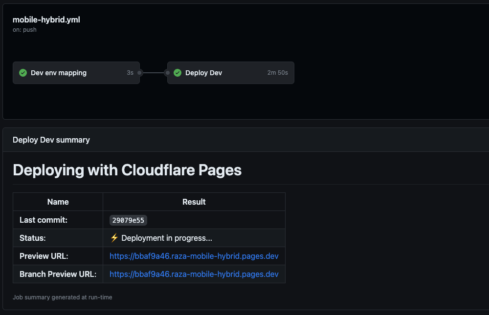

# Mobile hybrid app

This package contains the web UI code that runs in our blue light card mobile app for both Android and iOS.

The purpose of this hybridisation, is to help easily roll out experimental changes without the need for an app release, since experimenting will need to be frequent.

## Architecture


Native provides a bridge to open communication between native and web UI, which is expressed through the use of interfaces. Certain communication is only one way based on it's usecase, for example sending analytics data when a user interacts with an element within the web UI is only one way, web UI doesn't need to receive anything regarding analytics from native, however there are others that are two way such as data requests.

### How does web communicate with native?

As mentioned above, we use interfaces to define the communication layers, we'll use analytics for this example.

Native injects a shim for analytics into the webview once the page has loaded by attaching it to the window object, this uses the agreed interface AnalyticsRequest and provides a `postMessage` function:

```js
window.webkit = {};
window.webkit.messageHandlers = {};
window.webkit.messageHandlers.AnalyticsRequest = {
  postMessage: function (json) {
    AnalyticsRequest.postMessage(JSON.stringify(json));
  },
};
```

The `postMessage` function must receive a JSON payload which helps the native side to call the right event, the payload structure:

```json
{
  "message": "functionName",
  "parameters": {}
}
```

The `message` property will be the name of the interfaced function, and `parameters` is the argument to pass to the interfaced function on the native side.

For analytics the payload would look like:

```json
{
  "message": "logAnalyticsEvent",
  "parameters": {
    "event": "",
    "parameters": {}
  }
}
```

This is abstracted away using the `Facade` class that can be extended on for any classes that need to communicate with native. So for analytics, an invoke class is created to handle analytics communication here `src/invoke/analytics.ts`.

```ts
import { Logger } from '@/logger';
import Facade from './facade';

/**
 * @description Used to communicate analytics operations to the native app
 */
export default class InvokeNativeAnalytics extends Facade implements NativeAnalytics.Analytics {
  private logger: Logger;
  private TAG = 'InvokeNativeAnalytics';

  constructor() {
    super('AnalyticsRequest'); // This is the interface injected with shims by native as mentioned earlier
    this.logger = Logger.getInstance();
  }

  /**
   * @description Logs analytics events
   * @param event
   * @param meta
   */
  public logAnalyticsEvent(properties: NativeAnalytics.Parameters): void {
    this.logger.debug(
      `logging event '${properties.event}' with data ${JSON.stringify(properties.parameters)}`,
      this.TAG,
    );
    this.callFunction('logAnalyticsEvent', properties);
  }
}
```

We can then provide a function called `logAnalyticsEvent` which calls the abstract function `callFunction`. This function then calls the injected `postMessage` function.

`callFunction` takes two arguments: functionName, parameters. This is then converted to the JSON payload:

```json
{
  "message": "logAnalyticsEvent",
  "parameters": {
    "event": "",
    "parameters": {}
  }
}
```

So what actually happens behind the scenes is the Facade layer will construct this and call the `postMessage` function for us, sending that to native:

```ts
window.webkit.messageHandlers.AnalyticsRequest.postMessage({
  message: 'logAnalyticsEvent',
  parameters: {
    event: '',
    parameters: {},
  },
});
```

Based on the example above, to use the invoke class and send analytics data to native, you would do something like the below
```tsx
// create an instance of InvokeNativeAnalytics
const analytics = new InvokeNativeAnalytics();

const Home: NextPage<any> = () => {
  useEffect(() => {
    // call its function to send analytics data to native
    analytics.logAnalyticsEvent({
      event: 'homepage_viewed',
      parameters: {
        'scroll_depth_(%)': depth,
      },
    });
  }, []);
  return (
    <main>
      ...
    </main>
  );
};
```

### How does native communicate with web?

Web UI provides a set of invokable functions attached to the window object, based on the interfaces defined, so that native can send web data.

#### Example
Native needs to send simple messages to web UI and web UI needs to output these on a page.

  1. First step is to define the class that will handle receiving of the message. Since the message will be received from outside of NextJS lifecyle, we can use the observable pattern to help sync back within the NextJS app

      ```ts
      import { Logger } from '@/logger';
      import Observable from '@/observable';

      /**
       * @description Used to receive simple message from the native app
       */
      export default class NativeReceiveMessage implements NativeReceive.WebViewMessage {
        private logger: Logger;
        private static TAG = 'NativeReceiveMessage';

        constructor() {
          this.logger = Logger.getInstance();
        }

        /**
         * @param message
         */
        public onMessage(message: string): void {
          this.logger.debug(`message received from native '${message}'`, NativeReceiveAPIResponse.TAG);

          // We use the observable pattern which helps to use this data within the app
          Observable.getInstance().notify('nativeMessage', message);
        }
      }
      ```
  2. Next we need to consume this message from within the NextJS app and make it available for other components to consume, to do this requires merging the messages into shared state
      ```ts
      // setup the initial store state with defaults
      const initialState: AppStore = {
        messages: [],
        dispatch() {},
      };

      // create the context
      export const AppContext = createContext<AppStore>(initialState);

      // setup the store reducer to update/merge the state with new state
      const storeReducer: Reducer<AppContextStructure, DispatchActionData> = (state, action) => {
        switch (action.type) {
          case 'setMessages': {
            return {
              ...state,
              messages: [action.state].concat(...state.messages),
            };
          }
        }
        throw Error(`Unknown action: ${action.type}`);
      };

      // create store provider so we can include it in our component tree
      export const AppStoreProvider: FC<PropsWithChildren> = ({ children }) => {
        const [state, dispatch] = useReducer(storeReducer, initialState);
        useEffect(() => {
          // subscribe ahead of time to the nativeMessage event so on being notified, we can handle the message accordingly
          Observable.getInstance().subscribe('nativeMessage', (message: string) => {
            dispatch({
              type: 'setMessages',
              state: message,
            });
          });
        }, []);
        return <AppContext.Provider value={{ ...state, dispatch }}>{children}</AppContext.Provider>;
      };
      ```
  3. Finally all thats left is to consume this state from within a page
      ```tsx
      const Home: NextPage<any> = () => {
        const { messages } = useContext(AppContext);
        return (
          <main>
            <ul>
              {messages.map((message, index) => (
                <li key={`message_${index}`}>{message}</li>
              ))}
            </ul>
          </main>
        );
      };
      ```
  
### How do I test and debug?
To run a test within the app, you will need to do the following:
  1. Setup a Cloudflare pages project in Cloudflare, this will be used as your dev environment i.e raza-mobile-hybrid.
  2. Add your Github -> dev environment (Cloudflare Pages name) to the `dev-env-mapping.txt` like so:
     ```
     githubusername=user-mobile-hybrid
     ```
  3. Contact Assghar or Davie in the apps team and ask them to add your dev environment urls against your BLC email address, this means when logging into the app the webview will point to you dev environment.
     - They will also need to provide you with a debuggable app version, that you can either install on your own phone for your OS or run it within browserstack.
  4. When your ready to test your changes, just commit and push them up, then you should see a CI job deploying to your dev environment, then log in to the app and you should see your changes.
     
     

### Logging
This package comes with logging capabilities to help with debugging both on the web UI side and native side.

Log levels:
 - Warn
 - Info
 - Error
 - Debug

Make sure to always provide a tag as part of your logs.
```ts
Logger.getInstance().debug('this is a message', 'TAG');
```

**Tip:** If you run the app within browserstack, you can see the logs from within the native and web UI.
