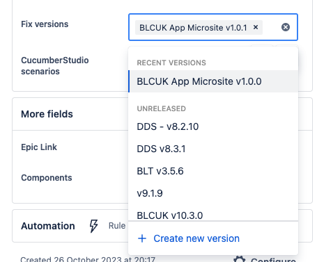
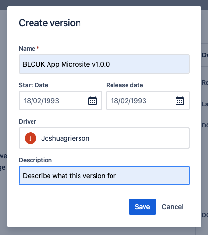
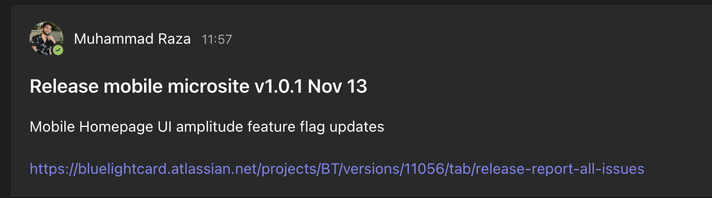

# Release Process
This documents the process for releasing microsite changes to app production.

Before doing a release, make sure your PR has been approved and tested.

## Steps
 1. Merge your PR to main, this will then trigger a changelog PR which will contain "release bluelightcard/mobile-hybrid" in the title.

 2. Open the changelog PR, and check the new version number (this follows semver), this will be used for our new release version.

 3. Now go over to your JIRA ticket, click "+ Create new version" and input the new version following the format `[region] App Microsite [release version]` along with the start date of work and release date (current date) and description of the release, then click "Save".

 

 

 4. Go to the releases page in JIRA and copy the link from the release you created and paste this into the changelog PR in Github. Assign a developer to review this changelog PR.

 5. Once changelog PR has been approved, merge it into main, this will now deploy your changes to production.

 6. When your changes are successfully deployed to production, do a quick test to make sure your changes are there and working, then post a message in the release channel in teams for the brand and region you deployed to (e.g BLCUK or BLCAU.)
 
 