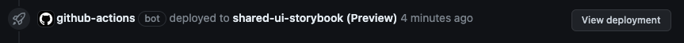

# Shared UI

This package holds all the shareable UI elements and utility code that can be used across the different frontend platforms: Web Desktop and Mobile Hybrid.

## Table of Contents

- [Get Started](#get-started)
- [Usage](#usage)
- [VSCode Snippets](#vscode-snippets)
- [Components](#components)
- [Hooks](#hooks)
- [Commits](#commits)
- [Pull Request](#pull-request)
- [Release](#release)
- [FAQ's](#faqs)

## Get Started

Install dependencies

```sh
npm install
```

Run storybook

```sh
npm run storybook
```

## Usage

### Prerequisite

This package can just be imported via NPM workspaces. This does enforce the following requirements onto consumers.

If using Next, then the consuming `next.config.js` will need to be updated to include Shared UI as an external package to also be transpiled:

```js
const nextConfig = {
  transpilePackages: ['@bluelightcard/shared-ui'],
};
```

If using Tailwind, then the consuming `tailwind.config.js` will need to be updated to include Shared UI as content for Tailwind to compile:

```js
module.exports = {
  content: ['./src/**/*.{js,ts,jsx,tsx,mdx}', '../shared-ui/src/**/*.{js,ts,jsx,tsx,mdx}'],
};
```

Then, Shared UI can just be imported and used in your code like so:

```tsx
import { Button } from '@bluelightcard/shared-ui';

const Page = () => {
  return (
    <div>
      <Button>Button</Button>
    </div>
  );
};
```

## VSCode Snippets

To provide a consistent starting point for creating new components, there are some vscode snippets available in the workspace.

On creating a new file, start typing one of the following words: `story`, `component`, `test` then select the snippet that matches the below.

- `story` - Component story
- `component` - Component
- `test` - Component unit test

This will now populate your file with the snippet code, the name of your component should match the base filename, which means for `index.tsx` you will need to replace `index` in the code with the name of your component.

## Components

Switch [component] with the name of your component, make sure it starts with an uppercase letter i.e Button.

On creating a new component, make sure it follows the below setup.

> **Note**: Make sure to import new components into `/src/index.tsx` otherwise it will not be accessible outside of the package, since this index file is the entry point to the package.

```
components/
├─ [component]/
│  ├─ [component].mdx
│  ├─ [component].stories.tsx
│  ├─ [component].spec.tsx
│  ├─ index.tsx
```

Any supporting components can go in a `/components` sub folder within the component folder.

### UX Documentation

Storybook docs are used for documenting the components and providing guidance on how to use the components.

Each component needs an `.mdx` file which will contain the documentation, see the [storybook docs](https://storybook.js.org/docs/writing-docs/doc-blocks)

### Tests

Unit tests should have at minimum a smoke test for each component, for example

```tsx
describe('smoke test', () => {
  const { baseElement } = render(<Component {...props} />);
  expect(baseElement).toBeDefined();
});
```

### Platform

Since these components will be used across different web based platforms, the component logic and UI code needs to work on both.

To manage this, use the `PlatformVariant` enum as part of the component props, for example having a larger padding on desktop as apposed to mobile:

```tsx
import { PlatformVariant, SharedProps } from './src/types';

export type Props = SharedProps & {
  text: string;
};

const Component: FC<Props> = ({ platform }) => {
  const css = platform === PlatformVariant.Mobile ? 'p-2' : 'p-4';
  ...
};
```

When it comes to managing data fetching or routing across both platforms, see [here](./Platform.md)

## Hooks

Hooks can be created under the `/src/hooks` folder and must start with `use` in the name, following Reacts naming convention for hooks.

> **Note**: If this hook is for public use (use as a shared library based hook), make sure to import new hooks into `/src/index.tsx` otherwise it will not be accessible outside of the package, since this index file is the entry point to the package.

## Commits

When commiting changes, make sure to follow the conventional commit [format](https://www.conventionalcommits.org/en/v1.0.0/#specification).

This is integral to release-please generating a release candidate version based on these standards.

This also means release-please will update the package version correctly, which is crucial for publishing [node packages](https://docs.npmjs.com/about-semantic-versioning).

Use the correct [commit format](https://www.conventionalcommits.org/en/v1.0.0/#specification) to make sure it lines up with [npm semver](https://docs.npmjs.com/about-semantic-versioning), otherwise rolling out a change that is incorrectly labeled can cause unintentional problems for the developers.

To summarise, appending an exclamation mark after the type/scope of the message, will mark it as a breaking change, and so release-please will increase the version number to a major version i.e `1.0.1 -> 2.0.0`.

## Storybook Preview

Storybook preview links are generated for each pull request and can be found in the list of deployments. Look for the deployment that looks like the below, and click "View deployment".



## Pull Request

There a few different types of pull requests.

- UX documentation pull request.
- Developer code pull request.
- Release candidate pull request (automated using release-please).

### UX

Designers and Developers both contribute to providing UI/UX documentation.

Add a developer and UX person to the pull request, provide an overview of what documentation you have updated/add.

**The approval criteria:**

- The reviewer should visit the storybook link generated and verify that the documentation looks ok and makes sense for the component(s).

If all the above criteria is met, the pull request can be approved.

### Developer

Add at least one developer and one UX person to your pull request for review. Make sure to add a link to the JIRA ticket.

The person reviewing the pull request can visit the generated storybook link.

**The approval criteria:**

- Make sure the work done ties in with the JIRA ticket.
- Developer should verify it follows the above requirements and the way to use the component makes sense.
- UX should verify the component follows the design guidelines/system provided through figma and the design documentation and that the behaviour is as expected.
- Accessibility tests in storybook for the component should pass.
- Both UX and the developer should make sure the component looks and behaves well across different platform modes i.e mobile or desktop.
- All lint and unit tests jobs should pass.

If all the above criteria is met, the pull request can be approved.

### Release Candidate

This is a final check before merging and triggering a release to production (Publish to registry). Add a developer to review.

Release please will create a CHANGELOG, categorising changes based on this [format](https://www.conventionalcommits.org/en/v1.0.0/#specification).

Update the content of the pull request to add any other info or additional context of the changes.

**The approval criteria:**

- Developer should verify the changes going in with the developer who did the original work.
- Make sure the new version is correct, if not verify with the developer before approving.

If all the above criteria is met, the pull request can be approved.

## Release

Once the release candidate pull request has been approved, merging the pull request will trigger a release job in the pipelines that will publish this new version to `npm.pkg.github.com`.

Once the pipeline has ran and is successful, post a release message on the cross-teams channel, noting the new release version and a link to the new release in Github packages for [shared-ui](https://github.com/orgs/bluelightcard/packages/npm/package/shared-ui). Please also give a summary of what is in this new release.

## FAQ's

### CI release job fails with error 'Cannot find module @rollup/rollup-linux-x64-gnu' or similar

This error occurs when npm is trying to download a binary for a build system matching the running architecture, but it's not listed in the package lock file.

Run the following command at the root of the monorepo:

```sh
npm update -w packages/shared-ui
```

This will make sure the packages and the dependencies are up to date, and will update your lockfile.

Then commit and push up the lockfile, and this should fix this error.
